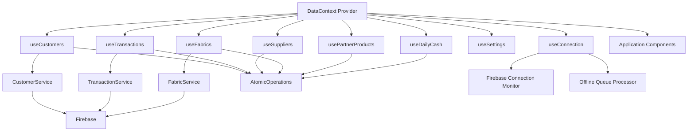

# Design Document

## Overview

This design document outlines the refactoring of the DataContext from a monolithic "God Object" (1400+ lines) into a composable architecture using custom React hooks. The refactoring follows the Composition Pattern, where each domain (customers, transactions, suppliers, fabrics, partner products, daily cash, settings, and connection state) is managed by a dedicated custom hook. The DataContext will serve as a thin orchestration layer that composes these hooks and provides a unified interface to the application.

### Current Architecture Problems

1. **Single Responsibility Violation**: DataContext handles 8+ distinct domains
2. **Testing Difficulty**: Cannot test individual domains in isolation
3. **Code Maintainability**: 1400+ lines in a single file makes changes risky
4. **Performance Issues**: All state updates trigger re-renders even for unrelated domains
5. **Coupling**: Business logic tightly coupled to context provider

### Proposed Architecture Benefits

1. **Separation of Concerns**: Each hook manages one domain
2. **Testability**: Hooks can be tested independently with mocked dependencies
3. **Reusability**: Hooks can be used outside DataContext if needed
4. **Performance**: Better memoization and selective re-rendering
5. **Maintainability**: Smaller, focused files are easier to understand and modify

## Architecture

### High-Level Structure

```
src/
├── contexts/
│   └── data-context.js (Orchestration Layer - 200 lines)
├── hooks/
│   ├── useCustomers.js (Customer Domain - ~200 lines)
│   ├── useTransactions.js (Transaction Domain - ~250 lines)
│   ├── useSuppliers.js (Supplier Domain - ~200 lines)
│   ├── useFabrics.js (Fabric/Inventory Domain - ~200 lines)
│   ├── usePartnerProducts.js (Partner Product Domain - ~200 lines)
│   ├── useDailyCash.js (Daily Cash Domain - ~200 lines)
│   ├── useSettings.js (Settings Domain - ~100 lines)
│   └── useConnection.js (Connection State Domain - ~150 lines)
└── services/
    ├── customerService.js (Existing)
    ├── transactionService.js (Existing)
    ├── fabricService.js (Existing)
    └── atomicOperations.js (Existing)
```

### Data Flow



### Hook Composition Pattern

Each domain hook follows this structure:

```javascript
function useDomain(db, logger, atomicOperations, dependencies) {
  // 1. Local state management
  const [state, dispatch] = useReducer(reducer, initialState);
  
  // 2. Service initialization
  const service = useMemo(() => new DomainService(...), []);
  
  // 3. Firebase listeners with debouncing
  useEffect(() => {
    // Set up real-time listeners
    return () => {
      // Cleanup
    };
  }, []);
  
  // 4. Memoized operations
  const operations = useMemo(() => ({
    add: service.add.bind(service),
    update: service.update.bind(service),
    delete: service.delete.bind(service),
  }), [service]);
  
  // 5. Memoized computed values
  const computedValues = useMemo(() => {
    // Expensive calculations
  }, [state]);
  
  // 6. Return state and operations
  return {
    ...state,
    ...operations,
    ...computedValues,
  };
}
```

## Components and Interfaces

### 1. useCustomers Hook

**Purpose**: Manage customer state and operations

**Interface**:
```typescript
interface UseCustomersReturn {
  // State
  customers: Customer[];
  loading: boolean;
  error: string | null;
  
  // Operations
  addCustomer: (customerData: Partial<Customer>) => Promise<string>;
  updateCustomer: (customerId: string, updatedData: Partial<Customer>) => Promise<void>;
  deleteCustomer: (customerId: string, transactions: Transaction[]) => Promise<void>;
  
  // Computed
  getCustomerDue: (customerId: string) => number;
  customerDues: Record<string, number>;
}
```

**Dependencies**:
- Firebase database instance
- Logger
- AtomicOperationService
- Transactions array (for due calculation)

### 2. useTransactions Hook

**Purpose**: Manage transaction state and operations

**Interface**:
```typescript
interface UseTransactionsReturn {
  // State
  transactions: Transaction[];
  loading: boolean;
  error: string | null;
  
  // Operations
  addTransaction: (transactionData: Partial<Transaction>) => Promise<string>;
  updateTransaction: (transactionId: string, updatedData: Partial<Transaction>) => Promise<void>;
  deleteTransaction: (transactionId: string) => Promise<void>;
  addPaymentToMemo: (memoNumber: string, paymentData: PaymentData, customerId: string) => Promise<string>;
  
  // Computed
  getCustomerTransactionsByMemo: (customerId: string) => MemoGroup[];
  getMemoDetails: (memoNumber: string) => MemoDetails | null;
  calculateCustomerTotalDue: (customerId: string) => number;
  getCustomerMemosWithDues: (customerId: string) => MemoGroup[];
}
```

**Dependencies**:
- Firebase database instance
- Logger
- AtomicOperationService
- TransactionService

### 3. useSuppliers Hook

**Purpose**: Manage supplier and supplier transaction state

**Interface**:
```typescript
interface UseSuppliersReturn {
  // State
  suppliers: Supplier[];
  supplierTransactions: SupplierTransaction[];
  loading: boolean;
  error: string | null;
  
  // Operations
  addSupplier: (supplierData: Partial<Supplier>) => Promise<string>;
  updateSupplier: (supplierId: string, updatedData: Partial<Supplier>) => Promise<void>;
  deleteSupplier: (supplierId: string) => Promise<void>;
  addSupplierTransaction: (transaction: Partial<SupplierTransaction>) => Promise<string>;
  deleteSupplierTransaction: (transactionId: string, supplierId: string, amount: number, paidAmount: number) => Promise<void>;
}
```

**Dependencies**:
- Firebase database instance
- Logger
- AtomicOperationService

### 4. useFabrics Hook

**Purpose**: Manage fabric inventory state and operations

**Interface**:
```typescript
interface UseFabricsReturn {
  // State
  fabrics: Fabric[];
  loading: boolean;
  error: string | null;
  
  // Operations
  addFabric: (fabricData: Partial<Fabric>) => Promise<string>;
  updateFabric: (fabricId: string, updatedData: Partial<Fabric>) => Promise<void>;
  deleteFabric: (fabricId: string) => Promise<void>;
  addFabricBatch: (batchData: BatchData) => Promise<string>;
  updateFabricBatch: (fabricId: string, batchId: string, updatedData: Partial<BatchData>) => Promise<void>;
  reduceInventory: (saleProducts: Product[]) => Promise<void>;
  
  // Utilities
  acquireBatchLock: (batchId: string) => Promise<boolean>;
  releaseBatchLock: (batchId: string) => Promise<void>;
}
```

**Dependencies**:
- Firebase database instance
- Logger
- AtomicOperationService
- FabricService

### 5. usePartnerProducts Hook

**Purpose**: Manage partner product state and operations

**Interface**:
```typescript
interface UsePartnerProductsReturn {
  // State
  partnerProducts: PartnerProduct[];
  loading: boolean;
  error: string | null;
  
  // Operations
  addPartnerProduct: (productData: Partial<PartnerProduct>) => Promise<string>;
  updatePartnerProduct: (productId: string, updatedData: Partial<PartnerProduct>) => Promise<void>;
  deletePartnerProduct: (productId: string) => Promise<void>;
  addPartnerToProduct: (productId: string, partnerName: string) => Promise<void>;
  addTransactionToPartner: (productId: string, partnerName: string, transactionData: any) => Promise<void>;
  updatePartnerName: (productId: string, oldName: string, newName: string) => Promise<void>;
  deletePartner: (productId: string, partnerName: string) => Promise<void>;
  updatePartnerTransaction: (productId: string, partnerName: string, transactionId: number, newTransactionData: any) => Promise<void>;
  deletePartnerTransaction: (productId: string, partnerName: string, transactionId: number) => Promise<void>;
}
```

**Dependencies**:
- Firebase database instance
- Logger
- AtomicOperationService

### 6. useDailyCash Hook

**Purpose**: Manage daily cash income and expense transactions

**Interface**:
```typescript
interface UseDailyCashReturn {
  // State
  dailyCashIncome: DailyCashTransaction[];
  dailyCashExpense: DailyCashTransaction[];
  loading: boolean;
  error: string | null;
  
  // Operations
  addDailyCashTransaction: (transaction: Partial<DailyCashTransaction>) => Promise<string>;
  updateDailyCashTransaction: (transactionId: string, updatedData: Partial<DailyCashTransaction>) => Promise<void>;
  deleteDailyCashTransaction: (transactionId: string, reference: string) => Promise<void>;
}
```

**Dependencies**:
- Firebase database instance
- Logger
- AtomicOperationService

### 7. useSettings Hook

**Purpose**: Manage application settings

**Interface**:
```typescript
interface UseSettingsReturn {
  // State
  settings: Settings;
  loading: boolean;
  error: string | null;
  
  // Operations
  updateSettings: (newSettings: Partial<Settings>) => Promise<boolean>;
}
```

**Dependencies**:
- Firebase database instance
- Logger
- AtomicOperationService

### 8. useConnection Hook

**Purpose**: Monitor Firebase connection state and manage offline queue

**Interface**:
```typescript
interface UseConnectionReturn {
  // State
  connectionState: 'connected' | 'connecting' | 'disconnected' | 'offline';
  offlineQueue: OfflineOperation[];
  pendingOperations: Set<string>;
  
  // Operations
  processOfflineQueue: () => Promise<void>;
}
```

**Dependencies**:
- Firebase database instance
- Logger
- AtomicOperationService

### 9. Refactored DataContext

**Purpose**: Compose all domain hooks and provide unified interface

**Structure**:
```javascript
export function DataProvider({ children }) {
  // Initialize shared dependencies
  const atomicOperations = useMemo(() => new AtomicOperationService(...), []);
  
  // Initialize domain hooks
  const connection = useConnection(db, logger, atomicOperations);
  const customers = useCustomers(db, logger, atomicOperations, transactions);
  const transactions = useTransactions(db, logger, atomicOperations);
  const suppliers = useSuppliers(db, logger, atomicOperations);
  const fabrics = useFabrics(db, logger, atomicOperations);
  const partnerProducts = usePartnerProducts(db, logger, atomicOperations);
  const dailyCash = useDailyCash(db, logger, atomicOperations);
  const settings = useSettings(db, logger, atomicOperations);
  
  // Compose context value
  const contextValue = useMemo(() => ({
    ...connection,
    ...customers,
    ...transactions,
    ...suppliers,
    ...fabrics,
    ...partnerProducts,
    ...dailyCash,
    ...settings,
    // Performance monitoring (existing)
    getPerformanceMetrics,
    getPerformanceBottlenecks,
  }), [connection, customers, transactions, suppliers, fabrics, partnerProducts, dailyCash, settings]);
  
  return (
    <DataContext.Provider value={contextValue}>
      {children}
    </DataContext.Provider>
  );
}
```

## Data Models

### Existing Models (No Changes)

All existing TypeScript/JSDoc type definitions remain unchanged:
- Customer
- Transaction
- Fabric
- Supplier
- SupplierTransaction
- DailyCashTransaction
- Settings
- PartnerProduct
- MemoGroup
- MemoDetails
- PaymentData
- BatchData
- Product

### New Internal Models

**HookState** (Generic state structure for each hook):
```typescript
interface HookState<T> {
  data: T[];
  loading: boolean;
  error: string | null;
}
```

**OfflineOperation**:
```typescript
interface OfflineOperation {
  id: string;
  name: string;
  fn: () => Promise<any>;
  fallbackFn?: () => Promise<void>;
  rollbackFn?: () => void;
  timestamp: string;
  retryCount: number;
}
```


## Correctness Properties

*A property is a characteristic or behavior that should hold true across all valid executions of a system-essentially, a formal statement about what the system should do. Properties serve as the bridge between human-readable specifications and machine-verifiable correctness guarantees.*

### Property 1: Firebase update debouncing

*For any* domain hook and any sequence of rapid Firebase data changes, the hook should debounce updates such that state is updated at most once per debounce period (300ms), preventing excessive re-renders.
**Validates: Requirements 1.2, 2.2, 3.2, 4.2, 5.2, 6.2**

### Property 2: CRUD operation validation

*For any* domain hook and any CRUD operation (add, update, delete), the hook should execute validation before performing the operation, and should reject invalid data with specific error messages.
**Validates: Requirements 1.3, 1.4, 2.3, 2.4, 3.3, 3.4, 4.3, 4.4, 5.3, 7.2, 7.4**

### Property 3: Customer deletion cascade

*For any* customer with any number of associated transactions, deleting the customer should atomically delete all associated transactions, ensuring no orphaned transaction records remain.
**Validates: Requirements 1.5**

### Property 4: Memoization consistency

*For any* hook with memoized computed values, when dependencies don't change, the memoized function should return the same reference, and when dependencies do change, it should recompute and return a new reference.
**Validates: Requirements 1.6**

### Property 5: Transaction memo grouping

*For any* customer ID and any set of transactions, grouping transactions by memo number should produce groups where each group contains exactly one sale transaction and zero or more payment transactions, with correct due calculations.
**Validates: Requirements 2.6**

### Property 6: Payment due recalculation

*For any* memo and any payment amount, adding a payment should reduce the memo's due amount by exactly the payment amount, and the total paid should equal the sum of all payments including the initial deposit.
**Validates: Requirements 2.7**

### Property 7: Supplier deletion atomicity

*For any* supplier with any number of supplier transactions, the deletion should first delete all supplier transactions, then delete the supplier, ensuring the operation is atomic (all succeed or all fail).
**Validates: Requirements 3.5**

### Property 8: Supplier due update atomicity

*For any* supplier transaction addition, the supplier's total due should be updated atomically with the transaction creation, ensuring the due amount always reflects all transactions.
**Validates: Requirements 3.6**

### Property 9: Fabric data transformation

*For any* Firebase fabric data structure (flat with nested batches object), the transformation should produce an array where each fabric has an id field and a batches array, preserving all data without loss.
**Validates: Requirements 4.2**

### Property 10: FIFO inventory reduction

*For any* set of sale products, reducing inventory should use the FIFO (First-In-First-Out) strategy, consuming from the oldest batches first, and should fail atomically if insufficient stock exists for any product.
**Validates: Requirements 4.5**

### Property 11: Fabric batch cascade deletion

*For any* fabric with any number of batches, deleting the fabric should remove the fabric and all its batches in a single atomic operation.
**Validates: Requirements 4.6**

### Property 12: Daily cash collection routing

*For any* daily cash transaction, if cashIn > 0 it should be routed to the income collection, and if cashOut > 0 it should be routed to the expense collection, with no transaction appearing in both collections.
**Validates: Requirements 5.2, 5.3**

### Property 13: Daily cash collection migration

*For any* daily cash transaction update that changes the transaction type (income to expense or vice versa), the transaction should be atomically removed from the old collection and added to the new collection.
**Validates: Requirements 5.4**

### Property 14: Daily cash referential integrity

*For any* daily cash transaction deletion that references a customer transaction (sale type), the related customer transaction's deposit should be reduced by the deleted transaction's cashIn amount.
**Validates: Requirements 5.5**

### Property 15: Sale deposit synchronization

*For any* sale transaction recorded in daily cash, the corresponding customer transaction's deposit field should be updated to reflect the payment, maintaining consistency between the two data sources.
**Validates: Requirements 5.6**

### Property 16: Partner duplicate prevention

*For any* product and any partner name, attempting to add a partner that already exists on that product should be prevented, ensuring no duplicate partner names within a single product.
**Validates: Requirements 6.3**

### Property 17: Partner transaction validation

*For any* transaction being added to a partner, the operation should validate that the partner exists on the product before adding the transaction, rejecting the operation if the partner is not found.
**Validates: Requirements 6.4**

### Property 18: Partner name update atomicity

*For any* partner name update, all references to the old name should be updated to the new name atomically within the product's partner accounts.
**Validates: Requirements 6.5**

### Property 19: Settings dual update atomicity

*For any* settings update, both Firebase and local state should be updated atomically, ensuring they never fall out of sync.
**Validates: Requirements 7.3**

### Property 20: Settings reactive updates

*For any* Firebase settings change (from another client or source), the local state should update reactively to reflect the new settings.
**Validates: Requirements 7.5**

### Property 21: Connection state transitions

*For any* Firebase connection event (connect or disconnect), the connection state should transition to the appropriate state (connected or disconnected) and trigger appropriate side effects (queue processing on reconnect).
**Validates: Requirements 8.2, 8.3, 8.4**

### Property 22: Offline queue persistence

*For any* operation queued while offline, the operation should remain in the queue until either successfully executed when connection is restored or permanently failed after max retries.
**Validates: Requirements 8.5**

### Property 23: Context value completeness

*For any* domain hook instantiated by DataContext, all state properties and operations from that hook should be exposed in the context value, ensuring consumers have access to all functionality.
**Validates: Requirements 9.2**

### Property 24: State propagation

*For any* state change in any domain hook, React context should propagate the change to all consuming components, triggering re-renders only for components that depend on the changed state.
**Validates: Requirements 9.3**

### Property 25: Performance metrics delegation

*For any* performance metrics request, DataContext should delegate to the performance tracking system and return the current metrics without modification.
**Validates: Requirements 9.6**

### Property 26: Hook operation completeness

*For any* custom hook, all CRUD operations and computed values defined in the hook's interface should be exposed in the return value, ensuring the public API is complete.
**Validates: Requirements 10.3**

### Property 27: Error isolation

*For any* error occurring in one domain hook, the error should not propagate to or affect the state or operations of other domain hooks, ensuring fault isolation.
**Validates: Requirements 10.4**

## Error Handling

### Error Isolation Strategy

Each domain hook manages its own error state independently:

```javascript
const [state, dispatch] = useReducer(reducer, {
  data: [],
  loading: true,
  error: null, // Hook-specific error state
});
```

When an error occurs in a hook:
1. The error is caught and stored in the hook's local error state
2. The error does not propagate to other hooks
3. The error is logged for debugging
4. The hook remains functional for retry attempts

### Error Types

All hooks will use the existing error types from `@/lib/errors`:
- `VALIDATION`: Input validation failures
- `NOT_FOUND`: Resource not found
- `NETWORK`: Network/connection errors
- `PERMISSION`: Authorization errors
- `CONFLICT`: Concurrent modification conflicts

### Error Recovery

Each hook implements error recovery strategies:

1. **Validation Errors**: Immediate rejection with detailed error messages
2. **Network Errors**: Automatic retry with exponential backoff (via AtomicOperationService)
3. **Not Found Errors**: Clear error state and allow user to retry
4. **Conflict Errors**: Rollback optimistic updates and refresh state

### Offline Error Handling

The `useConnection` hook manages offline scenarios:
- Operations are queued when offline
- Queued operations are retried when connection is restored
- Failed operations after max retries are removed from queue
- Optimistic updates are rolled back for permanently failed operations

## Testing Strategy

### Unit Testing Approach

Each custom hook will have comprehensive unit tests using React Testing Library's `renderHook`:

**Test Structure**:
```javascript
describe('useCustomers', () => {
  let mockDb, mockLogger, mockAtomicOps;
  
  beforeEach(() => {
    mockDb = createMockFirebaseDb();
    mockLogger = createMockLogger();
    mockAtomicOps = createMockAtomicOperations();
  });
  
  it('should initialize with empty customers array', () => {
    const { result } = renderHook(() => 
      useCustomers(mockDb, mockLogger, mockAtomicOps, [])
    );
    expect(result.current.customers).toEqual([]);
    expect(result.current.loading).toBe(true);
  });
  
  it('should add customer with valid data', async () => {
    const { result } = renderHook(() => 
      useCustomers(mockDb, mockLogger, mockAtomicOps, [])
    );
    
    const customerId = await result.current.addCustomer({
      name: 'John Doe',
      phone: '1234567890',
      address: '123 Main St'
    });
    
    expect(customerId).toBeDefined();
    expect(mockAtomicOps.execute).toHaveBeenCalledWith('addCustomer', expect.any(Function));
  });
});
```

**Coverage Goals**:
- Each hook: 90%+ code coverage
- All CRUD operations tested
- Error scenarios tested
- Edge cases tested (empty data, null values, etc.)

### Property-Based Testing Approach

We will use **fast-check** (JavaScript property-based testing library) to verify universal properties:

**Library**: fast-check (https://github.com/dubzzz/fast-check)

**Configuration**: Each property test will run a minimum of 100 iterations to ensure thorough coverage of the input space.

**Test Structure**:
```javascript
import fc from 'fast-check';

describe('Property Tests: useCustomers', () => {
  it('Property 2: CRUD operation validation', () => {
    fc.assert(
      fc.property(
        fc.record({
          name: fc.string({ minLength: 1, maxLength: 100 }),
          phone: fc.string({ minLength: 10, maxLength: 15 }),
          address: fc.option(fc.string({ maxLength: 500 })),
          email: fc.option(fc.emailAddress())
        }),
        async (customerData) => {
          const { result } = renderHook(() => 
            useCustomers(mockDb, mockLogger, mockAtomicOps, [])
          );
          
          // Valid data should succeed
          const customerId = await result.current.addCustomer(customerData);
          expect(customerId).toBeDefined();
        }
      ),
      { numRuns: 100 }
    );
  });
  
  it('Property 3: Customer deletion cascade', () => {
    fc.assert(
      fc.property(
        fc.record({
          customerId: fc.uuid(),
          transactions: fc.array(fc.record({
            id: fc.uuid(),
            customerId: fc.uuid(),
            total: fc.float({ min: 0, max: 10000 }),
            deposit: fc.float({ min: 0, max: 10000 })
          }))
        }),
        async ({ customerId, transactions }) => {
          const { result } = renderHook(() => 
            useCustomers(mockDb, mockLogger, mockAtomicOps, transactions)
          );
          
          await result.current.deleteCustomer(customerId, transactions);
          
          // Verify all transactions were deleted
          transactions.forEach(t => {
            expect(mockDb.remove).toHaveBeenCalledWith(
              expect.stringContaining(t.id)
            );
          });
        }
      ),
      { numRuns: 100 }
    );
  });
});
```

**Property Test Tags**: Each property-based test will include a comment explicitly referencing the correctness property:

```javascript
/**
 * Feature: data-context-refactor, Property 3: Customer deletion cascade
 * Validates: Requirements 1.5
 */
it('Property 3: Customer deletion cascade', () => { ... });
```

### Integration Testing

Integration tests will verify that hooks work correctly when composed in DataContext:

```javascript
describe('DataContext Integration', () => {
  it('should compose all hooks and expose unified interface', () => {
    const { result } = renderHook(() => useData(), {
      wrapper: ({ children }) => <DataProvider>{children}</DataProvider>
    });
    
    // Verify all domain operations are available
    expect(result.current.addCustomer).toBeDefined();
    expect(result.current.addTransaction).toBeDefined();
    expect(result.current.addSupplier).toBeDefined();
    expect(result.current.addFabric).toBeDefined();
    // ... etc
  });
  
  it('should isolate errors between domains', async () => {
    const { result } = renderHook(() => useData(), {
      wrapper: ({ children }) => <DataProvider>{children}</DataProvider>
    });
    
    // Cause error in customer domain
    await expect(result.current.addCustomer({})).rejects.toThrow();
    
    // Verify other domains still work
    await expect(result.current.addTransaction(validTransaction)).resolves.toBeDefined();
  });
});
```

### Test Utilities

Create shared test utilities for mocking:

**File**: `src/hooks/__tests__/utils/hookTestUtils.js`

```javascript
export function createMockFirebaseDb() {
  return {
    ref: jest.fn(),
    onValue: jest.fn(),
    push: jest.fn(),
    set: jest.fn(),
    update: jest.fn(),
    remove: jest.fn(),
    get: jest.fn(),
  };
}

export function createMockLogger() {
  return {
    info: jest.fn(),
    warn: jest.fn(),
    error: jest.fn(),
  };
}

export function createMockAtomicOperations() {
  return {
    execute: jest.fn((name, fn) => fn()),
    processOfflineQueue: jest.fn(),
  };
}

export function createMockCustomerService() {
  return {
    addCustomer: jest.fn(),
    updateCustomer: jest.fn(),
    deleteCustomer: jest.fn(),
    getCustomer: jest.fn(),
    calculateCustomerDue: jest.fn(),
  };
}

// ... similar mocks for other services
```

### Testing Best Practices

1. **Isolation**: Each hook test should not depend on other hooks
2. **Mocking**: Use mocks for Firebase and services to avoid real database calls
3. **Async Handling**: Properly handle async operations with async/await
4. **Cleanup**: Clean up subscriptions and timers in afterEach
5. **Deterministic**: Tests should be deterministic and not rely on timing
6. **Fast**: Unit tests should run quickly (< 1s per test)
7. **Descriptive**: Test names should clearly describe what is being tested

## Migration Strategy

### Phase 1: Create Hook Infrastructure (No Breaking Changes)

1. Create all custom hooks in `src/hooks/` directory
2. Implement hooks with same interfaces as current DataContext
3. Add comprehensive unit tests for each hook
4. Add property-based tests for correctness properties
5. Verify hooks work in isolation

**Success Criteria**: All hooks pass tests, 90%+ coverage

### Phase 2: Refactor DataContext (Backward Compatible)

1. Update DataContext to use new hooks internally
2. Keep existing context interface unchanged
3. Run full test suite to ensure no regressions
4. Perform manual testing of critical user flows
5. Monitor performance metrics

**Success Criteria**: All existing tests pass, no performance degradation

### Phase 3: Cleanup and Optimization

1. Remove old reducer logic from DataContext
2. Optimize memoization and re-render behavior
3. Add integration tests for hook composition
4. Update documentation
5. Remove deprecated code

**Success Criteria**: Reduced DataContext size to ~200 lines, improved performance

### Rollback Plan

If issues are discovered:
1. Revert DataContext to use old reducer-based approach
2. Keep new hooks for future use
3. Investigate and fix issues
4. Retry migration when ready

### Testing During Migration

- Run existing test suite after each phase
- Add new tests for hooks as they're created
- Use feature flags if needed to toggle between old/new implementations
- Monitor error rates and performance in development

## Performance Considerations

### Memoization Strategy

Each hook uses `useMemo` and `useCallback` to prevent unnecessary re-renders:

```javascript
// Memoize service instances
const service = useMemo(() => new DomainService(db, logger, atomicOps), [db, logger, atomicOps]);

// Memoize operations
const operations = useMemo(() => ({
  add: service.add.bind(service),
  update: service.update.bind(service),
}), [service]);

// Memoize computed values
const computedValues = useMemo(() => {
  // Expensive calculations
}, [dependencies]);
```

### Debouncing Firebase Updates

All Firebase listeners use debouncing to prevent excessive state updates:

```javascript
const debounceTimers = useRef({});

useEffect(() => {
  const unsubscribe = onValue(collectionRef, (snapshot) => {
    if (debounceTimers.current[collectionPath]) {
      clearTimeout(debounceTimers.current[collectionPath]);
    }
    
    debounceTimers.current[collectionPath] = setTimeout(() => {
      dispatch({ type: 'SET_DATA', payload: snapshot.val() });
    }, 300); // 300ms debounce
  });
  
  return () => {
    unsubscribe();
    Object.values(debounceTimers.current).forEach(clearTimeout);
  };
}, []);
```

### Selective Re-rendering

By splitting state into domain-specific hooks, components only re-render when their specific domain changes:

**Before** (monolithic context):
- Any state change triggers re-render of all consumers

**After** (composed hooks):
- Customer state change only affects components using customer data
- Transaction state change only affects components using transaction data
- etc.

### Performance Metrics

Continue using existing `performanceTracker` to monitor:
- Operation execution time
- Slow operations (> 2s)
- Average response time
- Operation count

Add new metrics for hooks:
- Hook initialization time
- State update frequency per hook
- Re-render count per hook

## Security Considerations

### Authentication

All hooks will use existing `requireAuth()` from `@/lib/authValidation` before executing operations:

```javascript
async function addCustomer(customerData) {
  requireAuth(); // Throws if not authenticated
  // ... rest of operation
}
```

### Input Sanitization

All hooks will use existing `sanitizeObject()` from `@/lib/sanitization` to prevent XSS:

```javascript
async function addCustomer(customerData) {
  const sanitizedData = sanitizeObject(customerData);
  // ... use sanitizedData
}
```

### Validation

All hooks will use existing validation utilities from `@/lib/validation`:
- `validateRequired()`
- `validateStringLength()`
- `validatePhoneNumber()`
- `validateEmail()`
- `validatePositiveNumber()`

### Firebase Security Rules

No changes to Firebase security rules are needed. Hooks will continue to respect existing rules:
- Read/write permissions based on authentication
- Data validation at database level
- Rate limiting for operations

## Dependencies

### External Dependencies

- **React** (^18.0.0): Core framework for hooks
- **Firebase** (^10.0.0): Database and real-time listeners
- **fast-check** (^3.0.0): Property-based testing library (dev dependency)

### Internal Dependencies

- `@/lib/firebase`: Firebase database instance
- `@/lib/errors`: Error types and AppError class
- `@/lib/validation`: Validation utilities
- `@/lib/sanitization`: Input sanitization
- `@/lib/authValidation`: Authentication checks
- `@/lib/memoization`: Memoized calculation utilities
- `@/lib/performanceTracker`: Performance monitoring
- `@/services/customerService`: Customer CRUD operations
- `@/services/transactionService`: Transaction CRUD operations
- `@/services/fabricService`: Fabric/inventory CRUD operations
- `@/services/atomicOperations`: Atomic operation execution
- `@/utils/logger`: Logging utility

### Service Layer

All hooks will depend on existing service classes:
- `CustomerService`: Handles customer operations
- `TransactionService`: Handles transaction operations
- `FabricService`: Handles fabric/inventory operations
- `AtomicOperationService`: Handles atomic execution and retry logic

No changes to service layer are required.

## Future Enhancements

### Potential Improvements

1. **Hook Composition Utilities**: Create helper functions for common hook patterns
2. **Optimistic Updates**: Add optimistic update support to all hooks
3. **Undo/Redo**: Implement undo/redo functionality at hook level
4. **State Persistence**: Add local storage persistence for offline-first experience
5. **Real-time Collaboration**: Add conflict resolution for concurrent edits
6. **Performance Dashboard**: Create UI to visualize hook performance metrics
7. **Hook DevTools**: Build custom DevTools extension for debugging hooks

### Extensibility

The new architecture makes it easy to add new domains:

1. Create new hook following the established pattern
2. Add hook to DataContext composition
3. Write tests for the new hook
4. No changes needed to existing hooks

Example: Adding a `useReports` hook:

```javascript
// src/hooks/useReports.js
export function useReports(db, logger, atomicOps) {
  // Implementation
}

// src/contexts/data-context.js
export function DataProvider({ children }) {
  // ... existing hooks
  const reports = useReports(db, logger, atomicOps);
  
  const contextValue = useMemo(() => ({
    // ... existing domains
    ...reports,
  }), [/* ... */, reports]);
}
```
